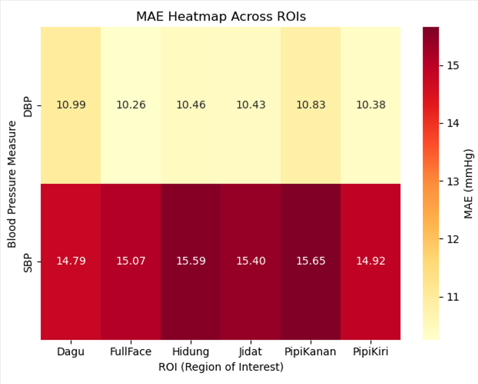
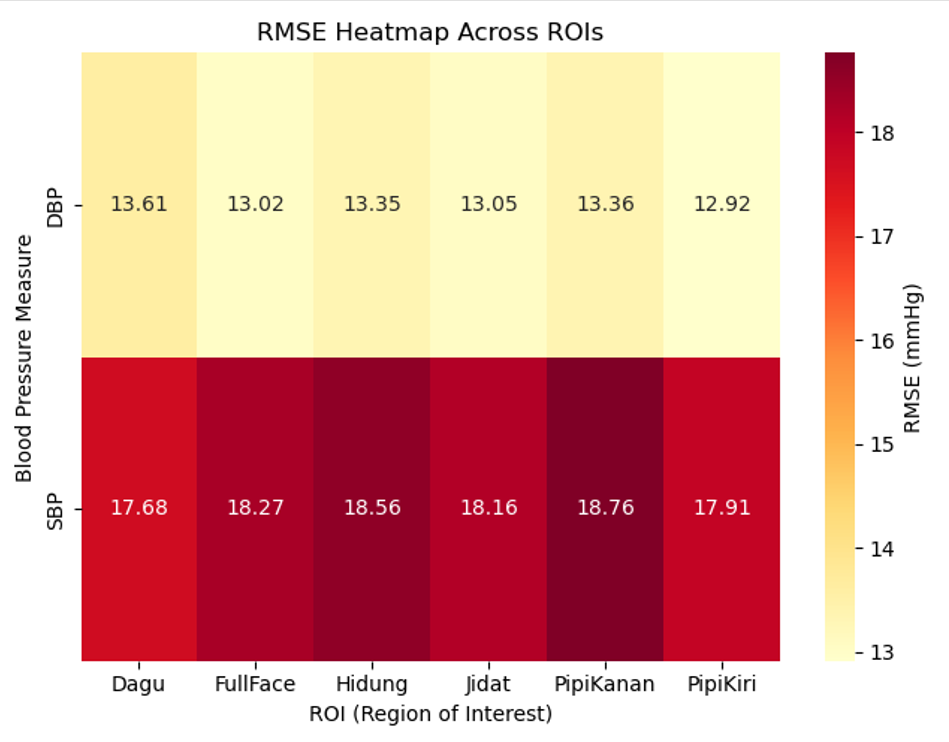

# [Komparasi ROI Pada Citra Wajah Orang Indonesia Untuk Pengukuran Tekanan Darah Non-Kontak Berdasarkan Metode Zhou]

## Abstrak
<p align="justify"> Tekanan darah merupakan suatu nilai yang diberikan darah kepada
dinding arteri dengan satuan tekanan darah adalah milimeter
air raksa (mmHg). Ada dua jenis tekanan darah yang terjadi
pada tubuh manusia, yaitu tekanan darah sistolik dan diastolik.
Pemeriksaan tekanan darah sangat penting, akan tetapi banyak
pasien merasa pengukuran tekanan darah dengan menggunakan
manset bertegangan tidak nyaman. Untuk itu dikembangkan
pengukuran tekanan darah secara non-kontak dengan mendeteksi
sinyal rPPG pada citra wajah pasien. Metode yang digunakan
untuk mendeteksi sinyal rPPG pada pasien adalah metode
Independent Component Analysis dengan pemilihan ROI seperti
wajah, dahi, pipi kanan, pipi kiri, hidung, dan dagu. Penelitian
ini mengevaluasi kinerja berbagai ROI untuk menemukan ROI
terbaik dalam estimasi tekanan darah sistolik dan diastolik. Untuk
mengevaluasi kinerja pada tiap ROI, digunakan metrik perthitungan
MAE dan RMSE.Dengan menggunakan dataset Physio ITERA
untuk mendeteksi sinyal rPPG menggunakan algoritma ICA dan
dihtung menggunakan perhitungan Zhou, maka ROI terbaik untuk
pengukuran tekanan darah sistolik adalah dagu dengan nilai MAE
sebesar 14.7 mmHg dan nilai RMSE sebesar 17.688 mmHg.
Sedangkan untuk pengukuran tekanan darah diastolik adalah ROI
Pipi Kiri dengan nilai MAE 10.38 mmHg dan nilai RMSE sebesar
12.92 mmHg. </p>

---

## Deskripsi Singkat
<p align="justify"> Program ini Proyek ini bertujuan untuk mengestimasi tekanan darah sistolik (SBP) dan diastolik (DBP) secara non-kontak menggunakan sinyal photoplethysmography (rPPG) yang diekstrak dari video wajah. 
  Metode ini memanfaatkan analisis sinyal pada channel warna hijau dan model regresi yang melibatkan BMI untuk meningkatkan akurasi prediksi. </p>
  
---

## Fitur & Tujuan Utama
* Ekstraksi Sinyal rPPG: Mengekstrak sinyal denyut nadi dari video wajah subjek.
* Pemrosesan Sinyal: Membersihkan sinyal mentah menggunakan teknik seperti detrending, filtering, dan normalisasi.
* Estimasi Tekanan Darah: Mengimplementasikan model regresi berdasarkan fitur sinyal dan data fisiologis (BMI) untuk memprediksi nilai SBP dan DBP.
* Analisis ROI: Menganalisis dan membandingkan kualitas sinyal dari berbagai area di wajah (dahi, pipi, dll.) dengan menggunakan metrik perhitungan MAE dan RMSE

## Struktur Repositori
Repositori berisi tentang
* "ZhouMethod.py" yang berisi langkah-langkah dalam memproses sinyal yang telah diambil dari file "processing_pipeline.py"
* "processing_pipeline.py" berfungsi sebagai ekstraksi sinyal RGB pada gambar-gambar yang ada di dataset
* "cek MAE RMSE.py" berfungsi sebagai menghitung MAE dan RMSE pada hasil tiap-tiap ROI
* "bp_resuls_all_rois.csv" berisi hasil yang telah didapat pada masing-masing ROI
* "bp_resuls_with_errors.csv" berisi hasil beserta selisih dari nilai prediksi dan nilai aktual
  

## Persyaratan Sistem

Sebelum menjalankan program, pastikan sistem Anda telah memenuhi persyaratan berikut:
- **Bahasa Pemrograman:** Python 3.12 (atau versi 3.8 - 3.10)
- **Environment Manager:** Anaconda atau Miniconda

### Dependencies
Program ini bergantung pada beberapa *library* utama untuk pemrosesan citra wajah dan sinyal:
- `mediapipe` (Ekstraksi ROI / Landmark Wajah dengan versi 0.10.10)
- `scipy` (`scipy.signal` untuk pemrosesan sinyal metode Zhou)
- `numpy` (Komputasi matriks/array)
- `pandas` (Manajemen dan analisis data)
- `matplotlib` (Visualisasi grafik/plot)

---

## Langkah Instalasi

Ikuti langkah-langkah berikut untuk mengatur *environment* dan menginstal dependensi dari awal hingga siap dijalankan:

1. **Clone Repositori**
   Buka Terminal atau Anaconda Prompt, lalu unduh repositori ini:
   ```bash
   git clone [https://github.com/AthaAkbar123/Pengukuran-Tekanan-Darah-non-Kontak.git](https://github.com/AthaAkbar123/Pengukuran-Tekanan-Darah-non-Kontak.git)
   cd Pengukuran-Tekanan-Darah-non-Kontak
   ```

2. **Buat Virtual Environment**
   Sangat disarankan menggunakan *environment* baru. Buat dan aktifkan *environment* conda (misalnya `rppg_env`):
   ```bash
   conda create -n rppg_env python=3.12
   conda activate rppg_env
   ```

3. **Instalasi Library**
   **Opsi 1: Menggunakan requirements.txt (Disarankan)**
   Jika tersedia file requirements, jalankan:
   ```bash
   pip install -r requirements.txt
   ```

   **Opsi 2: Instalasi Manual**
   Jika ingin menginstal secara manual pada *environment* conda Anda:
   ```bash
   conda install numpy pandas matplotlib scipy
   pip install mediapipe
   ```

---

## Cara Menjalankan Program

Setelah instalasi selesai dan *environment* `rppg_env` dalam keadaan aktif, Langkah pertama yang harus dilakukan yaitu menjalankan program bernama [ZhouMethod.py](src/ZhouMethod.py). Setelah menjalankan program [ZhouMethod.py](src/ZhouMethod.py), dilanjutkan dengan menjalankan program [processing_pipeline.py](src/processing_pipeline.py). Setelah menjalankan kedua program, program akan otomatis menghitung Tekanan darah masing-masing ROI berdasarkan tiap-tiap subjek.

---

## How to Cite

Jika Anda menggunakan kode, dataset, atau merujuk pada penelitian ini, mohon untuk mensitasinya menggunakan salah satu format berikut:

**APA Style:**
> Akbar, M. A. (2025). *Komparasi ROI Pada Citra Wajah Orang Indonesia Untuk Pengukuran Tekanan Darah Non-Kontak Berdasarkan Metode Zhou* [Skripsi, Institut Teknologi Sumatera].

**IEEE Style:**
> M. A. Akbar, "Komparasi ROI Pada Citra Wajah Orang Indonesia Untuk Pengukuran Tekanan Darah Non-Kontak Berdasarkan Metode Zhou," Skripsi, Program Studi Teknik Informatika, Institut Teknologi Sumatera, Lampung, 2025.

**BibTeX:**
```bibtex
@mastersthesis{akbar2025komparasi,
  author       = {Akbar, Muhamad Atha},
  title        = {Komparasi ROI Pada Citra Wajah Orang Indonesia Untuk Pengukuran Tekanan Darah Non-Kontak Berdasarkan Metode Zhou},
  school       = {Institut Teknologi Sumatera},
  year         = {2025},
  type         = {Skripsi},
  address      = {Lampung, Indonesia}
}
```
## Hasil
Hasil output keseluruhan  ROI dapat dilihat pada file  . Untuk hasil MAE dan RMSE dapat dilihat pada visualisasi di bawah ini:
<div align="center">
  
</div>

<div align="center">
  
</div>

## Kontak
* Muhammad Atha Akbar
* email: athaakbar2908@gmail.com 

